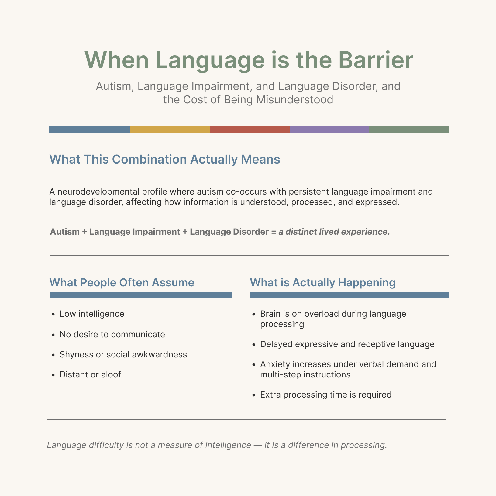

# my-projects
Interactive Power BI dashboards published to web

Click the image to open the live interactive dashboard (opens in a new tab).

### When Language Is the Barrier
A UX/UI project exploring design solutions for communication challenges when language is a barrier.

**Project Highlights:**
- User research insights and personas
- Wireframes and design solutions
- Visual design and accessibility considerations

**Project Preview:**

Click the image to view the full PDF.

### Perfect Pasta Pairing Dashboard
A Power BI dashboard analyzing pasta recipes, sauces, ingredients, and pairing suggestions.

**Features:**
- Average ratings and total cooking times per pasta type
- Ingredient analysis including meat/dairy content
- Visual KPIs with color-coded dashboards
- Matrix visualization with interactive icons

Click the image to open the live interactive dashboard (opens in a new tab).
